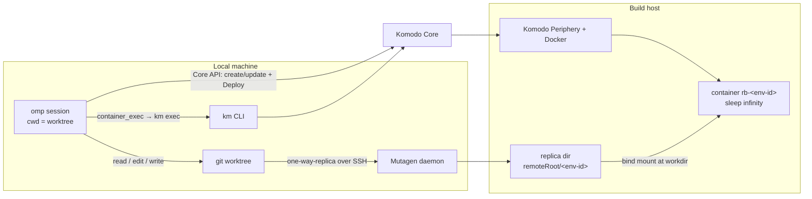
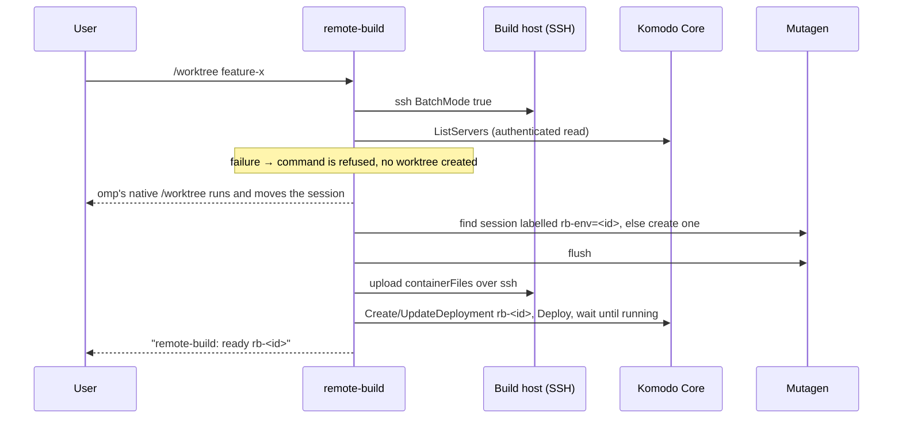

# omp-remote-build

An [Oh My Pi (`omp`)](https://github.com/can1357/oh-my-pi) plugin that gives every git worktree its own build/test environment on a remote Docker host:

- a **Mutagen one-way-replica** session mirrors the local worktree to the build host;
- a **Komodo Deployment** runs a long-lived container on that host with the replica bind-mounted as its working directory;
- four **`container_*` tools** give the agent an interactive PTY inside that container.

The agent keeps editing files locally with its normal tools. It compiles, tests and runs things on the remote machine through the container tools. Every tool call that could have changed files is followed by a Mutagen flush, so the container sees the edit before the agent's next step.

Projects opt in with one file, `.omp/remote-build.json`. Projects without it are never touched.

## How it works



### Environment lifecycle



- **Identity.** An environment belongs to one absolute worktree root. Its id is `<slug>-<hash>`: a slug of the directory name plus 10 hex chars of the SHA-256 of the canonical root path. The Mutagen session is `rb-<id>`, labelled `remote-build` and `rb-env=<id>`. The replica lives at `<remoteRoot>/<id>`, and the Komodo Deployment and its container are both named `rb-<id>`.
- **Authority.** The plugin keeps no state file. Mutagen's daemon decides whether a session exists (looked up by label), and Komodo Core decides whether a Deployment exists and is running. Re-preparing is idempotent: an existing session is reused, a Deployment whose managed fields already match and whose container is running is left alone, and a drifted one is updated and redeployed.
- **When an environment is prepared:**
  - after `/worktree` (or `/wt`) moves the session into a new worktree of an opted-in project;
  - at session start inside a non-main worktree that already has a Mutagen session (reopening or resuming a session there);
  - at session start of an **isolated subagent** (`task` with `isolated: true`), whose separate workspace gets its own environment.
  The main checkout never gets an environment by itself; remote environments are a worktree feature.
- **Gating.** While an environment is `preparing`, every tool call in that worktree waits for it. If preparation `failed`, every tool call there is blocked and the error is returned as the block reason. Restart the session after fixing the cause.
- **Flushing.** After each tool result, the plugin runs `mutagen sync flush` unless the tool is known not to write: `read`, `grep`, `glob`, `ast_grep`, `web_search`, `todo`, `ask`, `ctx`, `wait` and the four `container_*` tools. Everything else (`edit`, `write`, `eval`, `exec_command`, `bash`, `task`, …) counts as a potential write, because its side effects are unknown.

### What is synced

The replica is one-way: local → remote. Files the container creates (build output, caches) stay remote and are never copied back. `.git` is never synced. Git's active ignore sources are translated into Mutagen ignore patterns: `core.excludesFile` (default `$XDG_CONFIG_HOME/git/ignore`), `.git/info/exclude`, and every `.gitignore` in non-ignored directories, with `core.ignoreCase` honoured. Tracked files that match an ignore rule are still synced. Ignored build output therefore does not travel; it is rebuilt in the container. On top of that:

- `ignore` adds Mutagen patterns;
- `include` re-includes paths git ignores but the container needs;
- `containerFiles` targets are excluded from sync and uploaded separately, so a file can exist only on the remote side (for example a container-specific tool config).

The ignore set is fixed when the Mutagen session is created. After changing ignore rules, terminate the session (see [Cleanup](#cleanup)) so the next preparation recreates it.

## Requirements

|Component|Notes|
|---|---|
|`omp`|Plugins are loaded from `~/.omp/plugins`. Developed against `@oh-my-pi/pi-coding-agent` 18.6.|
|[`omp-unified-exec`](https://github.com/mouriya-s-lab/omp-unified-exec)|Installed as an omp plugin. The container tools reuse its PTY session, output buffering and escape decoding, imported as `omp-unified-exec/src/*`, so the package must be installed under that name next to this plugin.|
|A working PTY provider|`omp-unified-exec` loads `@homebridge/node-pty-prebuilt-multiarch`. If no prebuilt binary matches your Bun runtime's ABI, `container_exec` reports `Container PTY unavailable` with the loader error. You then need a native build or shim that makes the module loadable under Bun. The rest of the plugin still works.|
|[Mutagen](https://mutagen.io)|`mutagen` CLI locally. Its daemon starts on demand. It reaches the build host over SSH and installs its agent there automatically.|
|SSH|Non-interactive key-based access to the build host (`ssh -o BatchMode=yes <host> true` must succeed).|
|[Komodo](https://komo.do) Core + Periphery|Core reachable from the local machine. The build host is registered as a Komodo **Server**, with Periphery running and a Docker daemon available. Developed against Komodo v2.2.|
|`km` (komodo-cli)|Used for the container terminal (`km exec`). Its config file also supplies the Core URL and API credentials the plugin uses, so both paths share one source.|
|`git`, Bun|`git` for worktree discovery and ignore translation. Bun comes with omp.|

**Komodo permissions.** The API key in the km profile must be able to read Servers, Deployments and Updates; create and update Deployments; execute `Deploy`; and open container terminals on the build host's Server.

## Install

```bash
omp install https://github.com/mouriya-s-lab/omp-unified-exec   # dependency, once
omp install https://github.com/mouriya-s-lab/omp-remote-build
```

GitHub installs track the default branch; re-run the same `omp install <url>` to update. Restart `omp` after installing or updating.

Then create the two config files described below and restart `omp`.

## Configuration

### 1. Host config (per user): `~/.omp/agent/remote-build.json`

The file lives in omp's agent directory: `~/.omp/agent` by default, or wherever omp's agent dir points for the active profile. It describes the single build host. It is read again on every check, so edits apply without restarting omp. An example is in [`examples/remote-build.host.json`](examples/remote-build.host.json):

```json
{
  "ssh": "build-host",
  "remoteRoot": "/srv/remote-build",
  "komodo": {
    "profile": "build",
    "server": "build-host",
    "cliConfig": "~/.config/komodo/komodo.cli.toml"
  },
  "bin": {
    "km": "km",
    "mutagen": "mutagen"
  }
}
```

|Field|Required|Default|Meaning|
|---|---|---|---|
|`ssh`|yes|—|SSH destination of the build host: an alias from `~/.ssh/config` or `user@host`. Used by `ssh` and as the Mutagen beta endpoint (`<ssh>:<remoteRoot>/<id>`).|
|`remoteRoot`|yes|—|Absolute directory on the build host that holds one replica per environment. The Docker daemon managed by Periphery bind-mounts paths below it, so it must be a host path that daemon can access.|
|`komodo.profile`|yes|—|`[[profile]]` `name` or one of its `aliases` in `komodo.cliConfig`.|
|`komodo.server`|yes|—|Name of the Komodo Server (Periphery) that runs the containers.|
|`komodo.cliConfig`|no|`~/.config/komodo/komodo.cli.toml`|km CLI config file. A leading `~/` is expanded. It must be a single file: km's directory, keyword and environment-variable config merging is not reproduced.|
|`bin.km`|no|`km`|km executable. Bare names resolve through `PATH`. Use an absolute path if omp starts without your shell's `PATH`.|
|`bin.mutagen`|no|`mutagen`|Mutagen executable, same resolution rules.|

Unknown fields are rejected.

The referenced km profile looks like this. The plugin reads `host`, `key` and `secret` and never prints them:

```toml
[[profile]]
name = "build"
host = "https://komodo.example.com"
key = "K-..."
secret = "S-..."
```

### 2. Project opt-in (per repository): `.omp/remote-build.json`

Commit this at the repository root. Every worktree of the repository then carries it. An example is in [`examples/project.remote-build.json`](examples/project.remote-build.json):

```json
{
  "image": "rust:1-bookworm",
  "workdir": "/workspace",
  "shell": "bash",
  "ignore": ["*.log"],
  "include": [".env.build"],
  "containerFiles": {
    ".cargo/config.toml": ".omp/container-cargo-config.toml"
  },
  "volumes": ["rb-cargo-registry:/usr/local/cargo/registry"],
  "env": {
    "CARGO_TARGET_DIR": "/workspace/target"
  }
}
```

|Field|Required|Default|Meaning|
|---|---|---|---|
|`image`|yes|—|Container image of the build/test container.|
|`workdir`|no|`/workspace`|Absolute path in the container where the replica is mounted; also the container's working directory.|
|`shell`|no|`bash`|Program `container_exec` starts in the container; it must exist in the image.|
|`ignore`|no|`[]`|Extra Mutagen ignore patterns (Mutagen syntax, relative to the worktree root), applied after the translated git ignores.|
|`include`|no|`[]`|Repo-relative paths that git ignores but that must still be synced.|
|`containerFiles`|no|`{}`|Map of *remote target* → *local source*, both repo-relative. Each target is excluded from sync, and the source file's content is uploaded to the target on every preparation.|
|`volumes`|no|`[]`|Extra `docker run -v` specs (`host-or-volume:container[:mode]`), typically named cache volumes shared across environments.|
|`env`|no|`{}`|Extra container environment variables.|

Relative paths must not be absolute or contain `..`; unknown fields are rejected. Values in `volumes` and `env` cannot contain CR, LF, NUL or the sequence ` #`, because of a limitation in Komodo's key/value parser.

The container runs `sleep infinity` with restart policy `unless-stopped`. All work happens through the PTY tools.

## Usage

1. Start `omp` in an opted-in repository and run `/worktree <branch>` (or `/wt`). The plugin first checks SSH and Komodo; if either fails, the command is refused with an error and no worktree is created.
2. omp creates the worktree and moves the session into it. The status line shows `remote-build: preparing <root>` until a `remote-build: ready rb-<id>` notification appears. Tool calls made in the meantime wait.
3. The agent edits locally as usual and uses the container tools to build and test:

|Tool|Purpose|
|---|---|
|`container_exec`|Open a PTY running `shell` in the current worktree's container, with optional initial input (C-style escapes such as `\n`, `\x03`, `\x1b` are decoded; no newline is appended). Returns a `session_id` plus the output collected during `yield_time_ms` (default 10 s, range 0.25–30 s).|
|`container_write_stdin`|Send input to, or poll (omit `chars`) an existing session. The yield window defaults to 250 ms.|
|`container_list_sessions`|List this environment's PTY sessions, including ended ones whose final output has not been polled.|
|`container_kill_session`|Terminate the local `km` client (SIGTERM, then SIGKILL after 2 s). This does not stop the container, and the remote shell may outlive it; prefer sending `exit\n`.|

`km exec` itself always exits 0, so the transport's exit code says nothing about your command. Read command results from the shell, for example `cargo test; echo $?`. Output is sanitized and truncated to omp's default tail limits; the full transcript is kept in the session's `log_path`. Sessions are scoped to the environment of the current cwd, and all of them are closed when the omp session shuts down.

## Cleanup

The plugin creates resources but never deletes them, so removing a worktree leaves its environment behind. To remove one:

```bash
mutagen sync list --label-selector=remote-build      # find rb-<id>
mutagen sync terminate rb-<id>
# Komodo: delete the Deployment rb-<id> (UI or API), which removes its container
ssh <host> rm -rf <remoteRoot>/<id>
```

Named volumes listed in `volumes` are shared between environments and are not tied to any single one.

## Security notes

- Credentials come only from the km CLI config file you point at. Parse errors are reported without echoing file content, and Komodo error bodies are discarded rather than shown, because they can echo environment values.
- The Deployment is created with `skip_secret_interp: true`, so Komodo does not interpolate its secret variables into the container config.
- `env` values end up in the Komodo Deployment config in plain text. Do not put secrets there.

## Limitations

- One build host per user config; per-project host selection is not supported.
- The replica is one-way. Remote changes (generated files, formatter output run in the container) are not synced back.
- The flush after every non-read tool call adds a sync round-trip to each such call.
- The Mutagen ignore set is fixed at session creation.
- No automatic teardown (see [Cleanup](#cleanup)).
- `container_*` tools need a loadable PTY provider in the omp runtime.

## Development

```bash
bun install
bunx tsc --noEmit -p .
```

The `omp-unified-exec` dev dependency only provides types for local type-checking. At runtime the copy installed as an omp plugin is used.

## License

MIT
